# 📝 EXAMEN PRÁCTICO - SPRING BOOT

## PROYECTO 2: APLICACIÓN DE GESTIÓN DE TAREAS (TODO List API)

---

### **OBJETIVO:**
Desarrollar una API REST para gestionar tareas utilizando Spring Boot, con énfasis en filtros avanzados, búsquedas y consultas personalizadas.

---

## 📋 REQUISITOS FUNCIONALES

### Entidad: Task
Crear una entidad con los siguientes campos:

- **id** (Long, auto-generado)
- **title** (String, obligatorio, 3-100 caracteres)
- **description** (String, opcional, máximo 500 caracteres)
- **status** (Enum: `PENDING`, `IN_PROGRESS`, `COMPLETED`)
- **priority** (Enum: `LOW`, `MEDIUM`, `HIGH`)
- **dueDate** (LocalDate, fecha límite)
- **createdAt** (LocalDateTime, auto-generado)
- **updatedAt** (LocalDateTime, auto-actualizado)

---

## ✅ OPERACIONES REQUERIDAS

### 1. CRUD Básico
1. Crear una tarea
2. Obtener todas las tareas
3. Obtener una tarea por ID
4. Actualizar una tarea
5. Eliminar una tarea

### 2. Filtros
6. Filtrar tareas por **estado**
7. Filtrar tareas por **prioridad**
8. Filtrar tareas por **estado Y prioridad** (combinado)

### 3. Búsquedas por Fechas 
9. Buscar tareas por **rango de fechas** (fecha límite entre fecha1 y fecha2)
10. Obtener tareas **vencidas** (overdue: dueDate < hoy AND status != COMPLETED)

### 4. Búsqueda por Texto 
11. Buscar tareas por término en **título o descripción** (case-insensitive)

---

## 🔧 REQUISITOS TÉCNICOS OBLIGATORIOS

### Tecnologías:
- ✅ Spring Boot 3.x
- ✅ Spring Data JPA
- ✅ Base de datos H2 (en memoria)
- ✅ Validaciones con Bean Validation
- ✅ Manejo global de excepciones

### Arquitectura:
```
Controller → Service (Interfaz + Implementación) → Repository → Database
```

### Estructura del proyecto:
```
src/main/java/com/[tu-paquete]/
├── entity/
│   └── Task.java
├── enums/
│   ├── Status.java
│   └── Priority.java
├── repository/
│   └── TaskRepository.java
├── service/
│   ├── TaskService.java (interfaz)
│   └── impl/
│       └── TaskServiceImpl.java
├── controller/
│   └── TaskController.java
├── exception/
│   ├── TaskNotFoundException.java
│   ├── ErrorResponse.java
│   └── GlobalExceptionHandler.java
└── Application.java
```

---

## 🔗 ENDPOINTS REQUERIDOS

| Método | Endpoint | Descripción |
|--------|----------|-------------|
| `POST` | `/api/tasks` | Crear tarea |
| `GET` | `/api/tasks` | Obtener todas |
| `GET` | `/api/tasks/{id}` | Obtener por ID |
| `PUT` | `/api/tasks/{id}` | Actualizar tarea |
| `DELETE` | `/api/tasks/{id}` | Eliminar tarea |
| `GET` | `/api/tasks/status/{status}` | Filtrar por estado |
| `GET` | `/api/tasks/priority/{priority}` | Filtrar por prioridad |
| `GET` | `/api/tasks/filter?status=...&priority=...` | Filtro combinado |
| `GET` | `/api/tasks/due-date-range?startDate=...&endDate=...` | Rango de fechas |
| `GET` | `/api/tasks/overdue` | Tareas vencidas |
| `GET` | `/api/tasks/search?term=...` | Búsqueda por texto |

---

## ⚠️ RESTRICCIONES

### Prohibido:
- ❌ Usar DTOs (trabajar directamente con la entidad)
- ❌ Relaciones con otras entidades
- ❌ Librerías externas innecesarias

### Obligatorio:
- ✅ Enums para `status` y `priority`
- ✅ Índices en campos de búsqueda frecuente
- ✅ Al menos 2 consultas con `@Query` personalizada
- ✅ Validaciones con `@NotBlank`, `@NotNull`, `@Size`
- ✅ `@Transactional` donde corresponda
- ✅ Manejo de excepciones con `@RestControllerAdvice`

---

## ⭐ BONUS (puntos extra)

- ✨ Métodos de negocio en la entidad (`isOverdue`, `markAsCompleted`) - **+5 pts**
- ✨ Endpoint para contar tareas por estado - **+3 pts**
- ✨ Endpoints PATCH para cambiar estado (`in-progress`, `complete`) - **+4 pts**
- ✨ Logging con SLF4J en Service - **+3 pts**

---

## 📌 NOTAS IMPORTANTES

> ⚠️ El código debe **compilar y ejecutar sin errores**

> ⚠️ Todas las validaciones deben funcionar correctamente

> ⚠️ Los filtros deben retornar resultados correctos

> ⚠️ Probar endpoints antes de entregar

---


# JSON Y URLs para pruebas en POSTMAN
API REST para gestión de tareas (TODO List) desarrollada con Spring Boot. Permite crear, leer, actualizar y eliminar tareas, así como filtrarlas por estado, prioridad y fechas.

## 🚀 Configracion inicial
BASE URL:  http://localhost:8080/api/tasks

## Crear Tarea
### POST
```
http://localhost:8080/api/tasks
```
**Headers:**
Content-Type: application/json

5 tareas base para crear
- Tarea 1: Alta prioridad, pendiente
```
{
  "title": "Estudiar Spring Boot",
  "description": "Repasar conceptos de IoC, DI y configuración de Spring",
  "status": "PENDING",
  "priority": "HIGH",
  "dueDate": "2025-11-22"
}
```

- Tarea 2: Media prioridad, en progreso
```
{
  "title": "Desarrollar API REST",
  "description": "Implementar endpoints CRUD para la gestión de tareas",
  "status": "IN_PROGRESS",
  "priority": "MEDIUM",
  "dueDate": "2025-11-20"
}
```

- Tarea 3: Baja prioridad, pendiente
```
{
  "title": "Documentar proyecto",
  "description": "Crear README con instrucciones de uso y ejemplos",
  "status": "PENDING",
  "priority": "LOW",
  "dueDate": "2025-11-25"
}
```

- Tarea 4: Alta prioridad, completada
```
{
  "title": "Configurar base de datos",
  "description": "Instalar PostgreSQL y crear esquema inicial",
  "status": "COMPLETED",
  "priority": "HIGH",
  "dueDate": "2025-11-10"
}
```

- Tarea 5: Media prioridad, vencida (fecha pasada)
```
{
  "title": "Revisar código legacy",
  "description": "Refactorizar módulo de autenticación",
  "status": "PENDING",
  "priority": "MEDIUM",
  "dueDate": "2025-11-05"
}
```
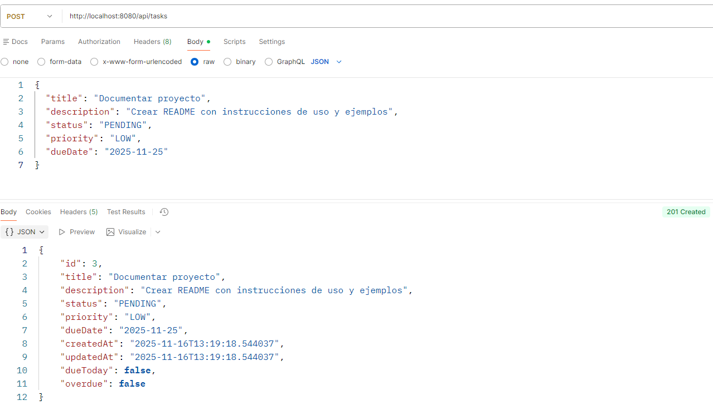

## Obtener Todas las tareas
### GET 
```
http://localhost:8080/api/tasks
```
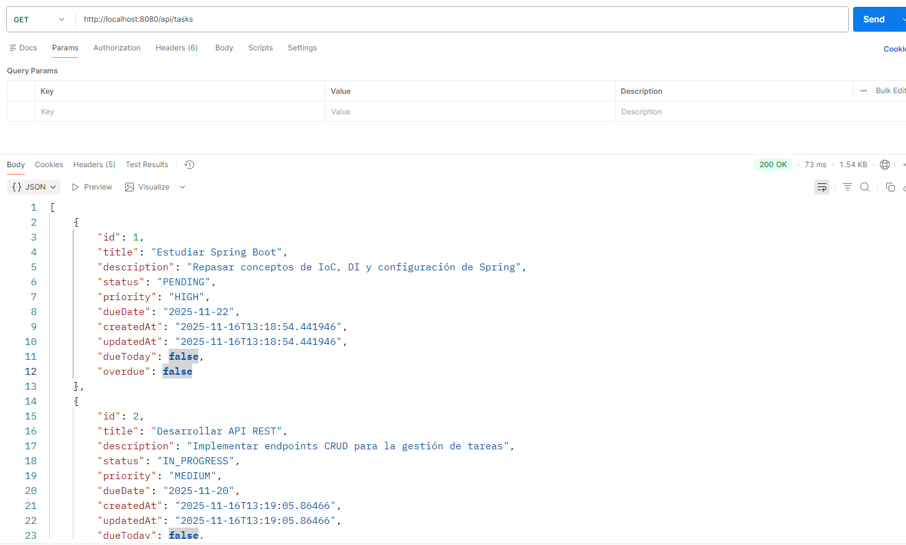

## Obtener tarea por id
### GET
```
http://localhost:8080/api/tasks/1
```
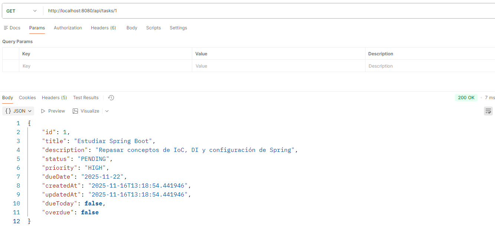

## Actualizar tarea
### PUT
```
http://localhost:8080/api/tasks/1
```
**Headers:**
Content-Type: application/json
```
{
  "title": "Estudiar Spring Boot - ACTUALIZADO",
  "description": "Incluir Spring Data JPA y Spring Security",
  "status": "IN_PROGRESS",
  "priority": "HIGH",
  "dueDate": "2025-11-25"
}
```
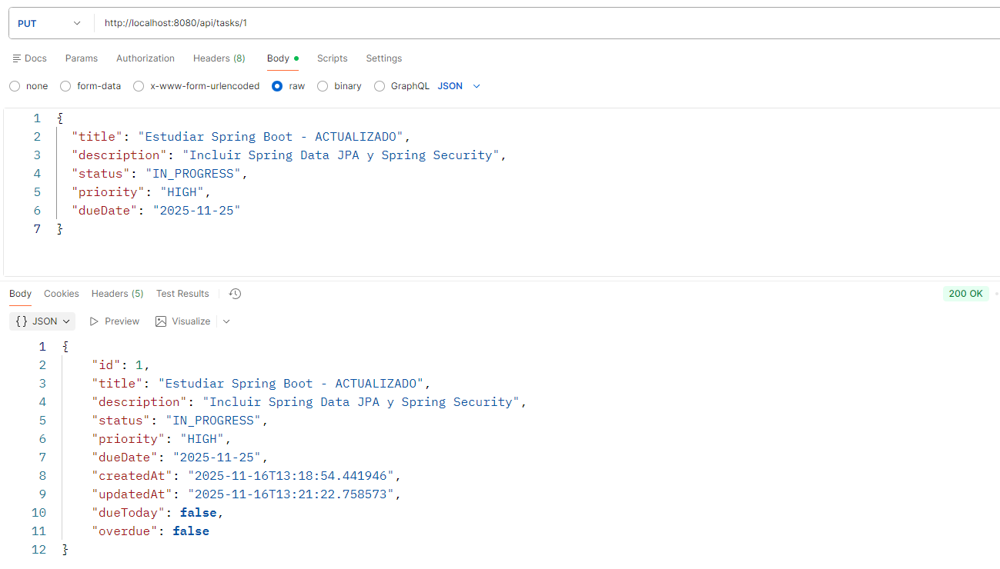

## Eliminar Tarea
### DELETE
```
http://localhost:8080/api/tasks/1
```
(Sin body - solo código de estado) - 204 No Content
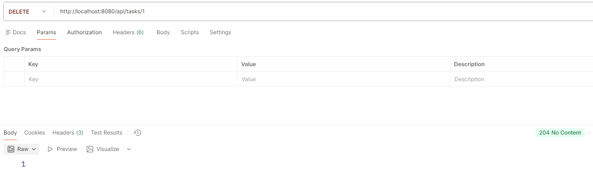

## Filtrar por estado
### GET
```
http://localhost:8080/api/tasks/status/PENDING
```
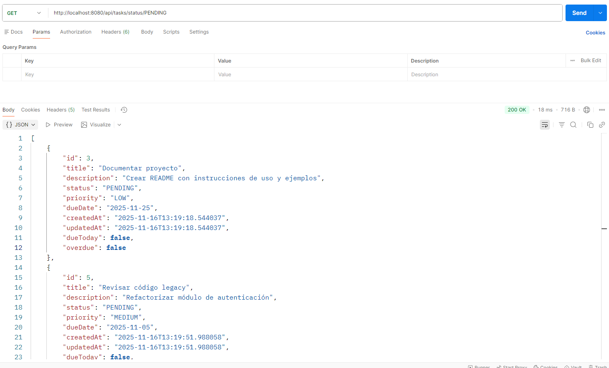

## Filtrar por prioridad
### GET 
```
http://localhost:8080/api/tasks/priority/HIGH
```
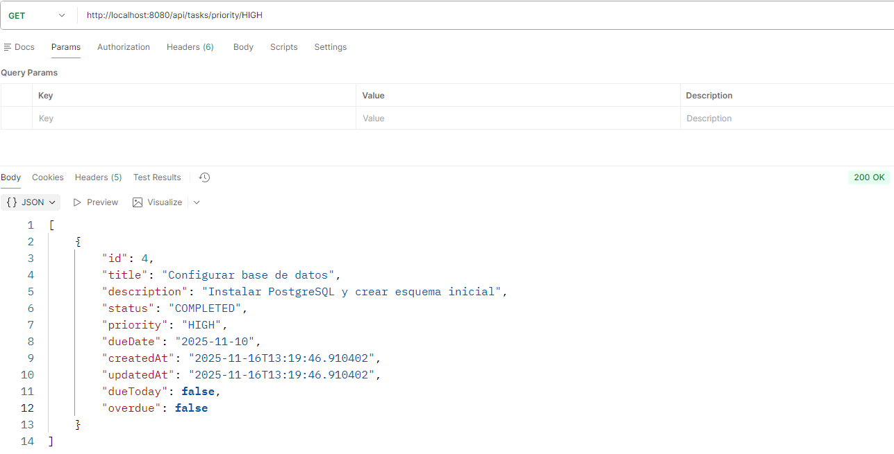

## Filtrar por estado y prioridad
### GET
```
http://localhost:8080/api/tasks/filter?status=PENDING&priority=LOW
```
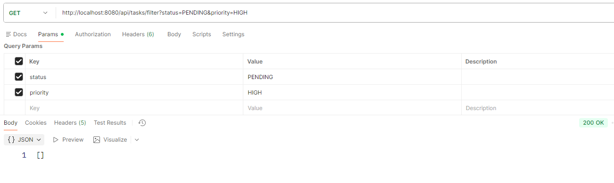

## Busqueda por fechas
### GET
```
http://localhost:8080/api/tasks/due-date-range?startDate=2025-11-15&endDate=2025-11-22
```
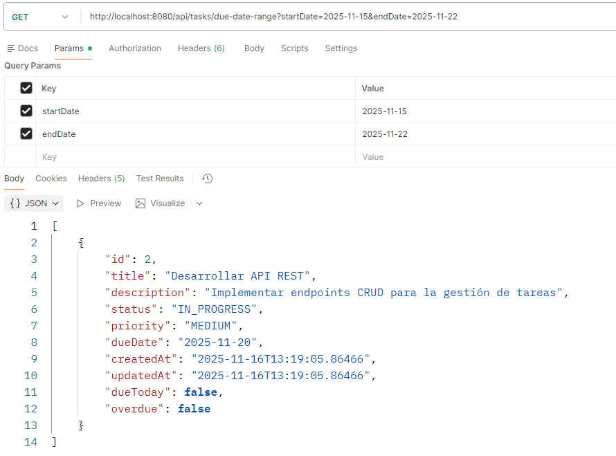

## Obtener tareas vencidas
### GET
```
http://localhost:8080/api/tasks/overdue
```
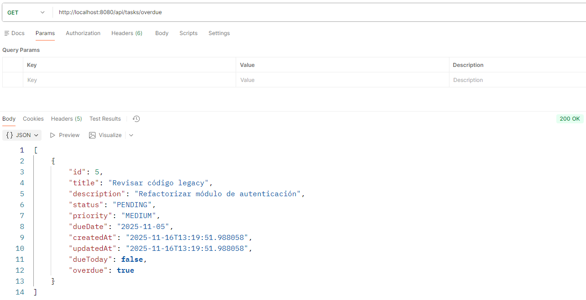

## Obtener tareas que vencen hoy
### GET
```
http://localhost:8080/api/tasks/due-today
```
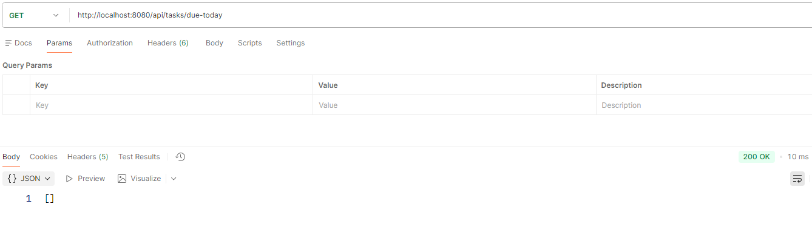

## Busqueda por titulo y descripcion
### GET
```
http://localhost:8080/api/tasks/search?term=documentar
```
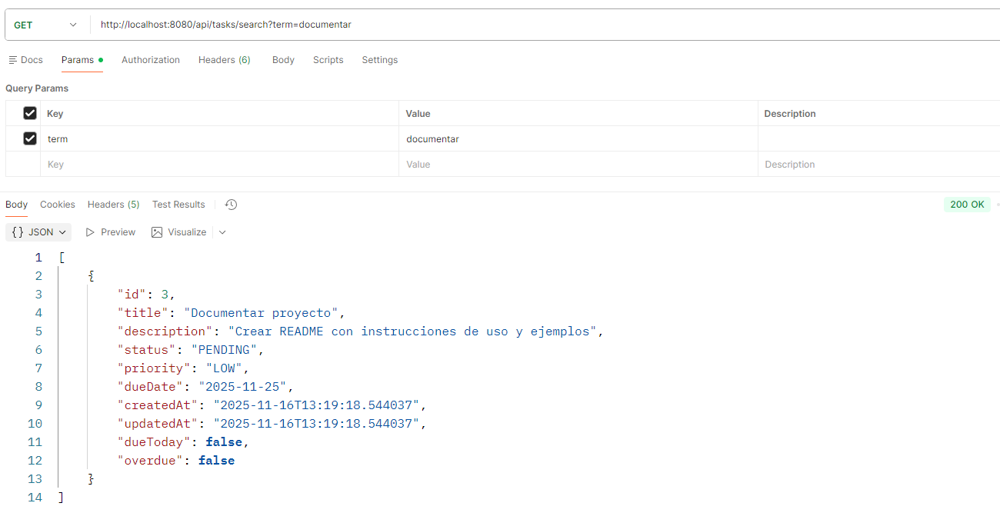

## Marcar como en progreso
### PATCH
```
http://localhost:8080/api/tasks/2/in-progress
```
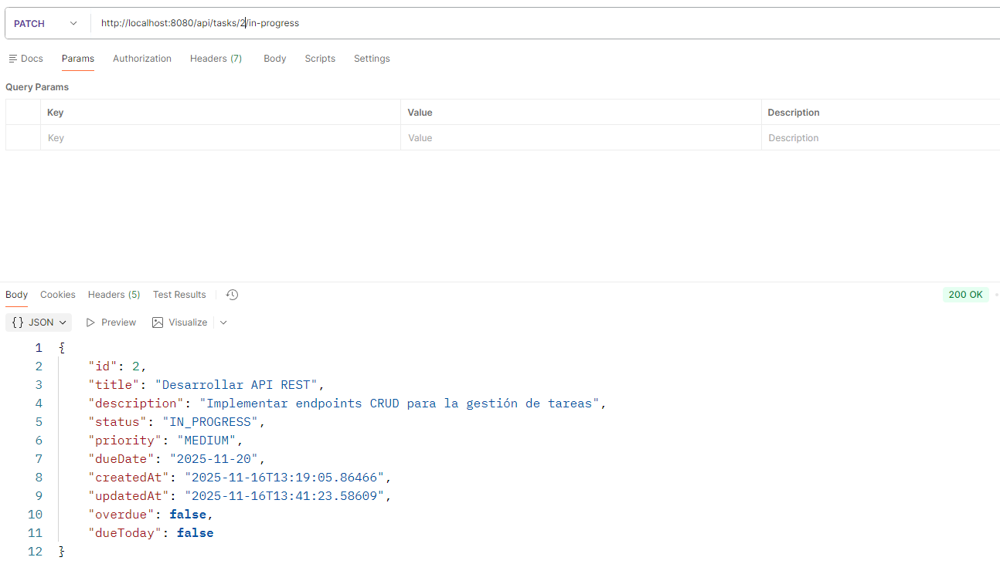

## Marcar como completada
### PATCH
```
http://localhost:8080/api/tasks/2/complete
```


## Contar tareas por estado
### GET
```
http://localhost:8080/api/tasks/count/status/COMPLETED
```
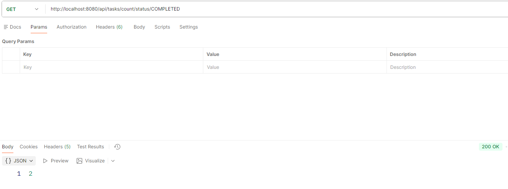

## ERRORES
### POST
- Titulo vacio
```
http://localhost:8080/api/tasks
```
```
{
  "title": "",
  "description": "Descripción válida",
  "status": "PENDING",
  "priority": "HIGH"
}
```
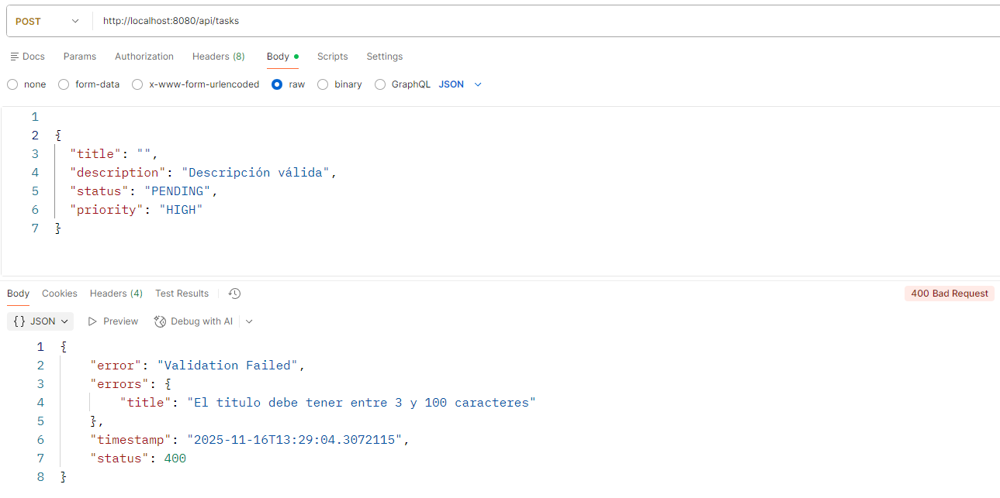

- Estado nulo
```
http://localhost:8080/api/tasks
```
```
{
  "title": "Tarea válida",
  "description": "Descripción válida",
  "status": null,
  "priority": "HIGH"
}
```
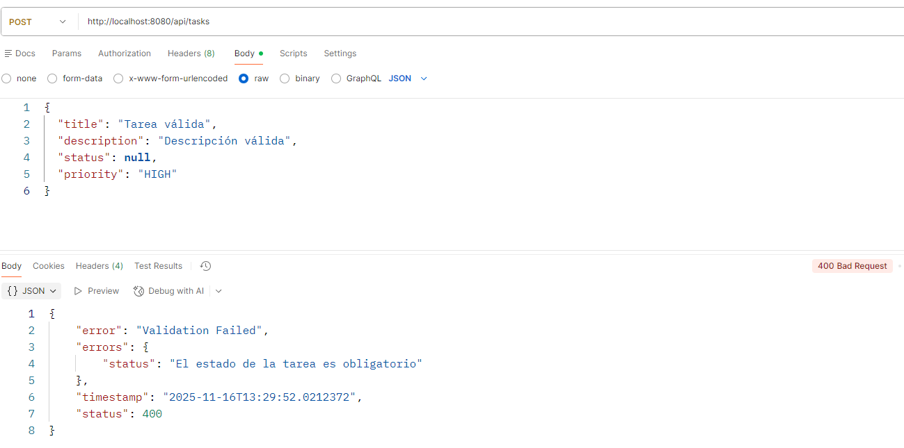


